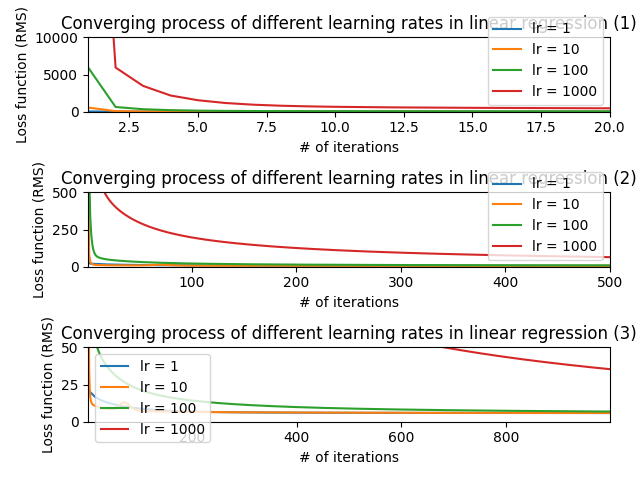

### 1

1.

Loss function of models with lr(learning rate) = 1 and lr = 10 converges almost to the same point zero, while the model with lr = 100 converge near zero, but the model with lr = 1000 still is not converging after 1000 iterations. This is because the learning rate is too high and the model always overshoots while descending and never approaches near the optimal point.  

2.

By, seperating the data set into a 80% training set and a 20% validation set, we obtain the results

Itr : 10000

dayhours: 0 - 9, loss 2.833482

dayhours: 5 - 9, loss 2.836354

This is because the there is more information for the model to infer the value, the precision is improved.

3.

Itr : 10000

all attributes

dayhours: 0 - 9, loss 2.833482

only PM 2.5

dayhours: 0 - 9, loss 5.589200

This is because the there is more information for the model to infer the value, the precision is improved.

### 2

